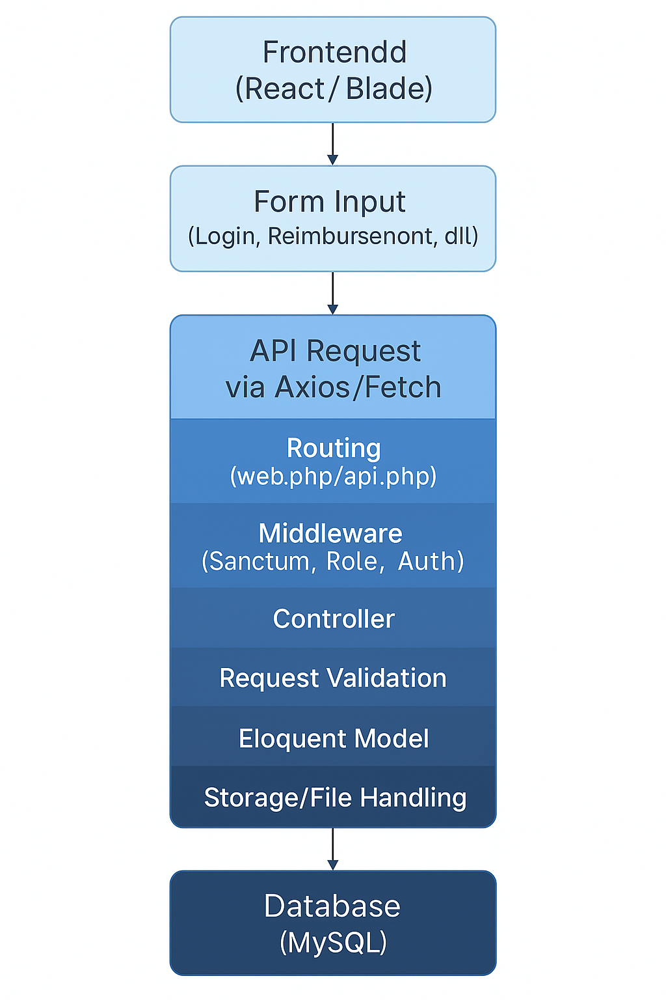

<p align="center"><a href="https://laravel.com" target="_blank"></a></p>

<p align="center">
<a href="https://github.com/laravel/framework/actions"></a>
<a href="https://packagist.org/packages/laravel/framework"></a>
<a href="https://packagist.org/packages/laravel/framework"></a>
<a href="https://packagist.org/packages/laravel/framework"></a>
</p>
# 💼 Reimbursement System API (Laravel)

Sistem API untuk manajemen reimburse menggunakan Laravel, cocok untuk digunakan oleh **Employee**, **Manager**, dan **Admin**.

===============================================================
## ⚠️ Kendala yang Dihadapi
================================================================
<p>Karena keterbatasan spesifikasi perangkat yang saya gunakan, saya tidak dapat menjalankan backend dan frontend secara bersamaan. Hal ini menyebabkan sistem menjadi tidak stabil saat pengembangan paralel/bersamaan.
oleh karena itu, saya memilih untuk memfokuskan pengembangan pada sisi **backend**, sesuai dengan kebutuhan lowongan yang dituju. namun demikian, saya juga memiliki kemampuan dalam pengembangan frontend, dan berencana menggunakan **react** sebagai framework utama apabila spesifikasi laptop saya mencukupi</p>


## ⚙️ Teknologi yang Digunakan

| No | Teknologi                        | Deskripsi                                                                 |
|----|----------------------------------|---------------------------------------------------------------------------|
| ✅ 1 | **Laravel (v12 terbaru)**     | Framework utama untuk backend API. Mengatur routing, controller, model, middleware, dll. |
| ✅ 2 | **Laravel Sanctum**               | Autentikasi token-based untuk login dan akses API (via Postman). Menyediakan endpoint `/login`, `/me`, `/logout` dan middleware `auth:sanctum`. |
| ✅ 3 | **Eloquent ORM**                 | Interaksi database menggunakan model (`User`, `Reimbursement`, `Category`). Menangani relasi seperti `user()->reimbursements()`. |
| ✅ 4 | **File Upload (Laravel Storage)** | Menyimpan bukti reimburse (pdf/jpg/dll) di direktori `storage/app/public`. |
| ✅ 5 | **Form Request Validation**       | Validasi input secara otomatis (title, amount, submitted_at, dll). |
| ✅ 6 | **Spatie Laravel Permission** *(Opsional)* | Manajemen role: admin, manager, user. Proteksi route dengan `middleware('role:admin')`. |
| ✅ 7 | **Carbon**                        | Library untuk manipulasi dan pengecekan tanggal (misalnya membatasi limit bulanan reimburse). |
| ✅ 8 | **Laravel Soft Deletes**          | Data tidak langsung dihapus, tapi bisa di-*restore*. Digunakan pada tabel `reimbursements`. |
| ✅ 9 | **Migration & Seeder**            | Pengelolaan struktur database (`reimbursements`, `categories`, `activity_logs`, dll). |
| ✅ 10 | **Activity Logging (Custom)**      | Logging manual untuk create, update, delete, status change ke tabel `activity_logs`. |

---

## 🔐 Autentikasi

### 🔸 Lihat Data User yang Login
`GET http://localhost:8000/api/me`  
🔐 *Butuh token*

### 🔸 Login
`POST http://localhost:8000/api/login`

### 🔸 Register
`POST http://localhost:8000/api/register`

---

## 📂 Endpoint Category (Kategori)

### 🔹 Lihat Semua Kategori  
`GET http://localhost:8000/api/categories`  
📌 *Public*

### 🔹 Tambah Kategori (Admin)  
`POST http://localhost:8000/api/categoryAdmin`  
🔐 *Admin*

### 🔹 Lihat Semua Kategori (Admin)  
`GET http://localhost:8000/api/categoryAdmin`  
🔐 *Admin*

### 🔹 Lihat Detail Kategori (Admin)  
`GET http://localhost:8000/api/categoryAdminShow/{id}`  
🔐 *Admin*

### 🔹 Update Kategori (Admin)  
`PUT http://localhost:8000/api/categories/{id}`  
🔐 *Admin*

---

## 🧾 Endpoint Reimbursement

### 🔹 CRUD Reimbursements (Employee)
`GET|POST|PUT|DELETE http://localhost:8000/api/reimbursements`  
🔐 *Employee*

### 🔹 Lihat Semua Reimbursement (Manager)  
`GET http://localhost:8000/api/manager/reimbursementsManager`  
🔐 *Manager*

### 🔹 Update Status Reimbursement (Manager)  
`PUT http://localhost:8000/api/reimbursements/{id}`  
🔐 *Manager*

### 🔹 Soft Delete Reimbursement (Admin)  
`DELETE http://localhost:8000/api/reimbursements/{id}`  
🔐 *Admin*

### 🔹 Lihat Semua Reimbursement (Admin)  
`GET http://localhost:8000/api/reimbursementsAdmin`  
🔐 *Admin*

---

## 📎 Catatan

- Gunakan tools seperti **Postman** untuk mengakses dan menguji endpoint API.
- Tambahkan header:  
  `Authorization: Bearer {token}` untuk endpoint yang membutuhkan autentikasi.
- File bukti reimburse disimpan di direktori:  
  `storage/app/public` dan dapat diakses menggunakan `php artisan storage:link`.

---


# 🧾 Reimbursement App (Laravel)

Aplikasi manajemen reimbursement berbasis Laravel, lengkap dengan autentikasi API, logika perhitungan otomatis, dan struktur kode yang rapi untuk pengembangan lanjutan.

---

## 🎨 Penjelasan Desain

### ⚙️ Alasan Pemilihan Pendekatan

- **Laravel** dipilih karena:
  - Mendukung pembuatan API dengan struktur yang rapi
  - Sistem autentikasi dan validasi yang kuat
  - Manajemen database melalui Eloquent ORM
- **Laravel Sanctum** digunakan untuk autentikasi API yang ringan namun aman, ideal untuk SPA (React) dan testing via Postman.
- **Eloquent ORM** mempermudah manipulasi dan relasi data antar tabel secara efisien.

---

## 💸 Perhitungan Remunerasi

- Perhitungan total pengajuan per bulan dilakukan sepenuhnya di **backend** menggunakan query builder dan library **Carbon**.
- Contoh logika:
  - Membatasi jumlah maksimal reimbursement per bulan dengan `whereMonth()`, `sum('amount')`, dan validasi kustom.
- Hasil akhir langsung dikirim ke frontend, sehingga tampilan hanya fokus pada penyajian data.

---

## ⚙️ Setup & Deploy Lokal

### ✅ Prasyarat

- PHP >= 8.2  
- Composer  
- MySQL / MariaDB  

### 🛠️ Langkah-langkah Instalasi

```bash
# Clone repository
git clone https://github.com/username/nama-project.git
cd nama-project

# Install dependensi
composer install

# Salin file environment dan generate app key
cp .env.example .env
php artisan key:generate

# Konfigurasi database di file .env
DB_DATABASE=reimburse_app
DB_USERNAME=root
DB_PASSWORD=

# Jalankan migrasi & seeder (opsional)
php artisan migrate --seed

# Buat symbolic link untuk file upload
php artisan storage:link

# Jalankan server lokal
php artisan serve

=======================================================================================================================

## 🚧 Tantangan & Solusi

| Tantangan                         | Solusi                                                                 |
|----------------------------------|------------------------------------------------------------------------|
| 🔐 Autentikasi fleksibel & aman   | Menggunakan **Laravel Sanctum** untuk SPA dan API testing             |
| 🧮 Validasi & pembatasan data     | Menggunakan **Form Request Validation** dan **Carbon**                |
| 📁 Manajemen file upload          | Memanfaatkan **Laravel Storage** dan `storage:link`                   |
| 👥 Role & Hak Akses               | Implementasi **Spatie Laravel Permission** untuk kontrol via middleware |
| 📊 API untuk frontend             | Response standar berbasis **JSON** dengan pesan dan status yang jelas |

=======================================================================================================================


## 📣 Kontribusi & Lisensi

Feel free untuk mengembangkan lebih lanjut project ini!  
Lisensi mengikuti [MIT License](LICENSE) *(jika ada)*.

---

